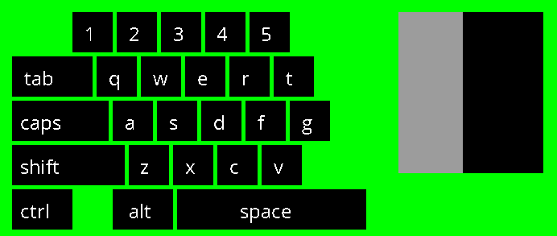

# Easy Overlay
A very simple partial keyboard and mouse overlay for Linux systems running X11.
Its build in SDL2 utilizing X11 for the keyboard and mouse inputs.

### Requirements 
Make sure you have `libxi-dev` and `libsdl2-dev` installed before trying to build from source. 

### Quick start
```shell
git clone https://github.com/kregerl/easy-overlay.git
cd easy-overlay
cmake CMakeLists.txt && make
./easy-overlay
```

### Usage
```shell
USAGE: ez_overlay [OPTIONS]
  OPTIONS
    --help   Display this message
    -mid     The mouse device id
    -kid     The keyboard device id
```

